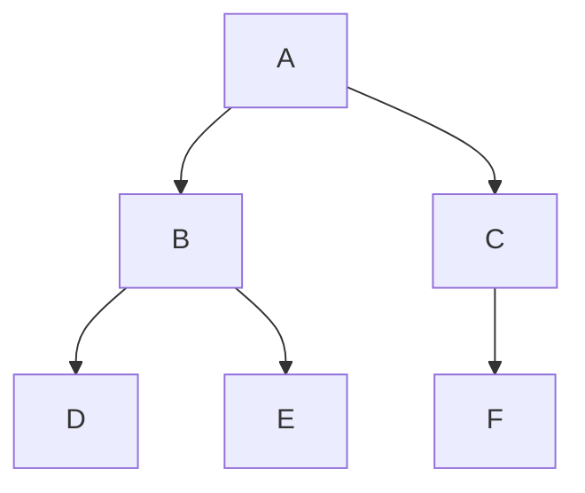
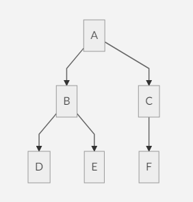

## Nodejs基础
---
### 模块

__require__：require函数用于在当前模块中加载和使用别的模块，传入一个模块名，返回一个模块导出对象。模块名可使用相对路径(以./开头)，或者是绝对路径(以/或C:之类的盘开头)。另外，模块名中的.js扩展名可以省略。
```js
var foo1 = require('./foo');
var foo2 = require('./foo.js');
var foo3 = require('/home/user/foo');
var foo4 = require('/home/user/foo.js');
// foo1至foo4保存的是同一个模块的导出对象。
```
可以使用以下方式加载和使用一个json文件。
```js
var data = require('./data.json');
```

__exports__：exports对象是当前模块的导出对象，用于导出模块公有方法和属性。别的模块通过require函数使用当前模块时得到的就是当前模块的exports对象。
```js
exports.hello = function () {
    console.log('Hello World!');
}
```

__module__：通过module对象可以访问到当前模块的一些相关信息，但最多的用途是替换当前模块的导出对象。
```js
module.exports = function () {
    console.log('Hello World!');
}
```
以上代码中，模块默认导出对象被替换为一个函数，

__模块初始化__：一个模块中的js代码仅在模块第一次被使用时执行一次，并在执行过程中初始化模块的导出对象。之后，缓存起来的导出对象被重复利用。

## 代码的组织和部署
---
### 模块路径解析规则
require函数支持斜杠(/)或盘符(C:)开头的绝对路径，也支持./开头的相对路径。但这两种路径在模块之间建立了强耦合关系，一旦某个模块文件的存放位置需要变更，使用该模块的其他模块的代码也需要跟着调整，变得牵一发动全身。因此，require函数支持第三种形式的路径，写法类似与foo/bar，并依次按照以下规则解析路径，直到找到模块位置。  

__内置模块__：如果传递给require函数的是NodeJS内置模块名称，不做路径解析，直接返回颞部模块的导出对象，例如require('fs')。

__node_modules目录__：NodeJS定义了一个特殊的node_modules目录用于存放模块。例如某个路径的绝对路径是/home/user/hello.js，在该模块中使用require('foo/bar')方式加载模块时，则NodeJS依次尝试使用以下路径。
```
/home/user/node_modules/foo/bar
/home/node_modules/foo/bar
/node_modules/foo/bar
```

__NODE_PATH环境变量__：与PATH环境变量类似，NodeJS允许通过NODE_PATH环境变量来指定额外的模块搜索路径。NODE_PATH环境变量中包含一到多个目录路径，路径之间在Linux下使用:分隔，在Windows下使用;分隔。  
`NODE_PATH=/home/user/lib:/home/lib`  
当使用require('foo/bar')的方式加载模块时，则NodeJS依次尝试以下路径。
```
/home/user/lib/foo/bar
/home/lib/foo/bar
```

### 包（package）
为了便于管理和使用，把由多个子模块组成的大模块称做包，并把所有子模块放在同一个目录里。  

__index.js__：当模块的文件名是index.js，加载模块时可以使用模块所在目录的路径代替模块文件路径。

__package.json__：如果想自定义入口模块的文件名和存放位置，就需要在包目录下包含一个package.json文件，并在其中指定入口模块的路径。
```
{
    "name": "cat",
    "main": "./lib/main.js"
}
```
NodeJS会根据包目录下的package.json找到入口模块所在位置。

### 命令行程序
Linux下
- 新建node-echo.js；在第一行添加`#! /usr/bin/env node`
- 赋予node-echo.js文件执行权限`chmod +x /home/user/bin/node-echo.js`
- 在PATH环境变量中指定的某个目录下`sudo ln -s /home/user/bin/node-echo.js /usr/local/bin/node-echo`  

Windows下
- 在Windows系统下的做法完全不同，我们得靠.cmd文件来解决问题。例如node-echo.js存放在C:\Users\user\bin目录，并且该目录已经添加到PATH环境变量里了。
- 接下来需要在该目录下新建一个名为mode-echo.cmd的文件。`@node "C:\User\user\bin\node-echo.js" %`
- 这样处理后，就可以在任何目录下使用node-echo命令了。

### 工程目录
```shell
- /home/user/workspace/node-echo/ # 工程目录
    - bin/ # 存放命令行相关代码
        node-echo
    + doc/ # 存放文档
    - lib/ # 存放API相关代码
        echo.js
    - node_modules/ # 存放三方包
        + argv/
    + tests/ # 存放测试用例
    package.json # 元数据文件
    README.md # 说明文件
```

### NPM
- 下载三方包
- 安装命令行程序
- 发布代码  
  第一次使用NPM发布代码前需要注册一个账号。终端下运行npm adduser,之后按照提示做即可。账号搞定后，接着我们需要编辑package.json文件，加入NPM必须的字段。  
  package.json里必要的字段如下。
  ```shell
  {
      "name": "node-echo", # 包名，在NPM服务器上须要保持唯一
      "version": "1.0.0", # 当前版本号
      "dependencies": { # 三方包依赖，需要指定包名和版本号
          "argv": "0.0.2"
      },
      "main": "./lib/echo.js" # 入口模块位置
      "bin": {
          "node-echo": "./bin/node-echo" #命令行程序名和主模块位置
      }
  }
  ```
  之后就可以在package.json所在的目录下运行npm public发布代码了。

__版本号__：语义版本号分为X.Y.Z三位，分别代表主版本号、次版本号和补丁版本号。
- 如果只是修复bug,需要更新Z位。
- 如果是新增了功能，但是向下兼容，需要更新Y位。
- 如果有大变动，向下不兼容，需要更新X位。

## 文件操作
---
### 小文件拷贝与大文件拷贝
[小文件拷贝文件](./util/small-file-copy.js)  
[大文件拷贝文件](./util/big-file-copy.js)  

命令行运行生成拷贝后的文件：  
`node small-file-copy.js counter.js small-counter-copy.js`  
`node big-file-copy.js counter.js big-counter-copy.js`

### API
__[Buffer(数据块)](https://nodejs.org/api/buffer.html)__
- NodeJS提供了一个与String对等的全局构造函数Buffer来提供对二进制数据的操作。除了可以读取文件得到Buffer的实例外，还能够直接构造。
- Buffer与字符串类似，除了可以用.length属性得到字节长度外，还可以用[index]方式读取指定位置的字节。
- Buffer与字符串能够互相转化。可以使用指定编码将二进制数据转化为字符串，也可以将字符串转换为指定编码下的二进制数据。
- Buffer与字符串有一个重要区别。字符串是只读的，并且对字符串的任何修改得到的都是一个新字符串，原字符串保持不变。至于Buffer，更像是可以做指针操作的C语言数组。
- 如果想要拷贝一份Buffer，得首先创建一个新的Buffer，并通过.copy方法把原Buffer中的数据复制过去。这个类似于申请一块新的内存，并把已有内存中的数据复制过去。

__[Stream(数据流)](https://nodejs.org/api/stream.html)__
- 当内存中无法一次装下需要处理的数据时，或者一边读取一边处理更加高效时，我们就需要用到数据流。
```js
var rs = fs.createReadStream(src);
var ws = fs.createWriteStream(dst);
rs.on('data', function (chunk) {

    // 根据.write方法的返回值来判断传入的数据是写入目标了还是临时放在了缓存了。
    if (ws.write(chunk) === false) {
        rs.pause();
    }
});

rs.on('end', function () {
    ws.end();
});

// drain事件来判断什么时候只写数据流已经将缓存中的数据写入目标，可以传入下一个代写数据了。
ws.on('drain', function () {
    rs.resume();
});
```
- 以上代码实现了数据从只读数据流到只写数据流的搬运，并包括了防爆仓控制。因为这种使用场景很多，例如大文件拷贝程序，NodeJS直接提供了.pipe方法来做这件事情，其内部实现方式与上边的代码类似。

__[File System(文件系统)](https://nodejs.org/api/fs.html)__
- 文件属性读写。  
    其中常见的有fs.stat、fs.chmod、fs.chown等等。
- 文件内容读写。  
    其中常见的有fs.readFile、fs.readdir、fs.writeFile、fs.mkdir等等。
- 底层文件操作。  
    其中常见的有fs.open、fs.read、fs.write、fs.close等等。
```js
fs.readFile(pathname, function (err, data) {
    if (err) {
        // Deal with error.
    } else {
        // Deal with data.
    }
});
// 基本上所有fs模块API的回调参数都有两个。第一个参数在有错误发生时等于异常对象，第二个参数始终用于返回API方法执行结果。

// fs模块的所有异步API都有对应的同步版本，用于无法使用异步操作时，或者同步操作更方便时的情况。
// 同步API除了方法名的末尾多了一个Sync之外，异常对象与执行结果的传递方式也有相应变化。
try {
    var data = fs.readFileSync(pathname);
    // Deal with data.
} catch (err) {
    // Deal with error.
}
```

__[Path(路径)](https://nodejs.org/api/path.html)__
- path.normalize  
  将传入的路径转换为标准路径，除了解析路径中的.与..外，还能去掉多余的斜杠。
> 标准化之后的路径里的斜杠在Windows系统下是\，而在Linux系统下是/。如果想保证任何系统下都使用/作为路径分隔符的话，需要用.replace(/\\/g, ‘/’)再替换一下标准路径。
- path.join  
  将传入的多个路径拼接为标准路径。该方法可避免手工拼接路径字符串的繁琐，并且能在不同系统下正确使用相应的路径分隔符。
  `path.join('foo/', 'baz/', '../bar');` // => "foo/bar" _windows下运行显示`"foo\\bar"`_
- path.extname
  当我们需要根据不同文件扩展名做不同操作时，该方法就显得很好用。
  `path.extname('foo/bar.js');` // => ".js"

### 遍历目录
__递归算法__：遍历目录时一般使用递归算法，否则就难以编写出简洁的代码。
> 使用递归算法编写的代码虽然简洁，但由于每递归一次就产生一次函数调用，在需要优先考虑性能时，需要把递归算法转换为循环算法，以减少函数调用次数。

__遍历算法__：目录是一个树状结构，在遍历时一般使用深度优先+先序遍历算法。深度优先，意味着到达一个节点后，首先接着遍历子节点而不是邻居节点。先序遍历，意味着首次到达了某节点就算遍历完成，而不是最后一次返回某节点才算数。因此使用这种遍历方式时，下边这棵树的遍历顺序是A > B > D > E > C > F；



__同步遍历__  
[同步遍历文件](./util/travel-folder.js)
```js
function travel(dir, callback) {
    fs.readdirSync(dir).forEach(function (file) {
        var pathname = path.join(dir, file);

        if (fs.statSync(pathname).isDirectory()) {
            travel(pathname, callback);
        } else {
            callback(pathname);
        }
    });
}
/*
 * 该函数以某个目录作为遍历的起点。遇到一个子目录时，就先接着遍历子目录。
 * 遇到一个文件时，就把文件的绝对路径传给回调函数。
 * 回调函数拿到文件路径后，就可以做各种判断和处理
 */
```

__异步遍历__  
如果读取目录或读取文件状态时使用的是异步API，目录遍历函数实现起来会有些复杂，但原理完全相同。
[异步遍历文件](./util/travel-folder-async.js)

### 文本编码
__BOM的移除__  
BOM用于标记一个文本文件使用Unicode编码，其本身是一个Unicode字符("\uFEFF")，位于文本文件头部。在不同的Unicode编码下，BOM字符对应的二进制字节如下：  

 Bytes | Encoding 
 ------ | ------
 FE FE | UTF16BE 
 FF FE | UTF16LE 
 EF BB BF | UTF8 

我们可以根据文本文件头几个字节等于啥来判断文件是否包含BOM，以及使用哪种Unicode编码。但是，BOM字符虽然起到了标记文件编码的作用，其本身却不属于文件内容的一部分，如果读取文本文件时不去掉BOM，在某些使用场景下就会有问题。例如我们把几个JS文件合并成一个文件后，如果文件中间含有BOM字符，就会导致浏览器JS语法错误。因此，使用NodeJS读取文本文件时，一般需要去掉BOM。
```js
function readText(pathname) {
    var bin = fs.readFileSync(pathname);
    if (bin[0] === 0xEF && bin[1] === 0xBB && bin[2] === 0xBF) {
        bin = bin.slice(3);
    }
    return bin.toString('utf-8');
}
```

__GBK转UTF8__  
NodeJS支持在读取文本文件时，或者在Buffer转换为字符串时指定文本编码，但遗憾的是，GBK编码不在NodeJS自身支持范围内。因此，一般我们借助iconv-lite这个三方包来转换编码。使用NPM下载该包后，我们可以按下边方式编写一个读取GBK文本文件的函数。
```js
var iconv = require('iconv-lite');

function readGBKText(pathname) {
    var bin = fs.readFileSync(pathname);
    return iconv.decode(bin, 'gbk');
}
```

__单字节编码__  
有时候，我们无法预知需要读取的文件采用哪种编码，因此也就无法指定正确的编码。比如我们要处理的某些CSS文件中，有的用GBK编码，有的用UTF8编码。虽然可以一定程度可以根据文件的字节内容猜测出文本编码，但这里要介绍的是有些局限，但是要简单得多的一种技术。  
首先我们知道，如果一个文本文件只包含英文字符，比如Hello World，那无论用GBK编码或是UTF8编码读取这个文件都是没问题的。这是因为在这些编码下，`ASCII0~128`范围内字符都使用相同的单字节编码。
反过来讲，即使一个文本文件中有中文等字符，如果我们需要处理的字符仅在`ASCII0~128`范围内，比如除了注释和字符串以外的JS代码，我们就可以统一使用单字节编码来读取文件，不用关心文件的实际编码是GBK还是UTF8。以下示例说明了这种方法。
```
1. GBK编码源文件内容：
    var foo = '中文';
2. 对应字节：
    76 61 72 20 66 6F 6F 20 3D 20 27 D6 D0 CE C4 27 3B
3. 使用单字节编码读取后得到的内容：
    var foo = '{乱码}{乱码}{乱码}{乱码}';
4. 替换内容：
    var bar = '{乱码}{乱码}{乱码}{乱码}';
5. 使用单字节编码保存后对应字节：
    76 61 72 20 62 61 72 20 3D 20 27 D6 D0 CE C4 27 3B
6. 使用GBK编码读取后得到内容：
    var bar = '中文';
```
这里的诀窍在于，不管大于0xEF的单个字节在单字节编码下被解析成什么乱码字符，使用同样的单字节编码保存这些乱码字符时，背后对应的字节保持不变。

NodeJS中自带了一种binary编码可以用来实现这个方法:
```js
function replace(pathname) {
    var str = fs.readFileSync(pathname, 'binary');
    str = str.replace('foo', 'bar');
    fs.writeFileSync(pathname, str, 'binary');
}
```

## 网络操作
---
__[HTTP](https://nodejs.org/api/http.html)__
- 作为服务端使用时，创建一个HTTP服务器，监听HTTP客户端请求并返回响应。  
  [作为服务端使用文件](./util/http-server.js)
- 作为客户端使用时，发起一个HTTP客户端请求，获取服务端响应。  
  [作为客户端使用文件](./util/http-client.js)

__[HTTPS](https://nodejs.org/api/https.html)__  
https模块与http模块极为类似，区别在于https模块需要额外处理SSL证书。

__[URL](https://nodejs.org/api/url.html)__  
处理HTTP请求时url模块使用率超高，因为该模块允许解析URL、生成URL，以及拼接URL。
```
                           href 
---------------------------------------------------------------------
                            host                  path
                        --------------- -----------------------
http:   // urse:pass  @ host.com : 8080 /p/a/t/h  ?query=string #hash
----       ----------   --------   ---- --------  ------------- -----
protocol     auth       hostname   port pathname      search     hash
                                                   ------------
                                                       query
```

我们可以使用.parse方法来讲一个URL字符串转换为URL对象。  
- 传给.parse方法的不一定要是一个完整的URL，
- .parse方法还支持第二个和第三个布尔类型可选参数。_(第二个参数等于true时，该方法返回的URL对象中，query字段不再是一个字符串，而是一个经过querystring模块转换后的参数对象。第三个参数等于true时，该方法可以正确解析不带协议头的URL)_

.format方法允许将一个URL对象转换为URL字符串。  
.resolve方法可以用于拼接URL。

__[Query String](https://nodejs.org/api/querystring.html)__  
querystring模块用于实现URL参数字符串与参数对象的互相转换。

__[Zlib](https://nodejs.org/api/zlib.html)__  
zlib模块提供了数据压缩和解压的功能。  
[压缩响应踢数据文件](./util/zlib-response.js)  
[解压响应体数据文件](./zlib-request.js)

__[Net](https://nodejs.org/api/net.html)__  
net模块可用于创建Socket服务器或Socket客户端。  
[socket服务器文件](./util/net-server.js)  
[socket客户端文件](./util/net-client.js)


## 进程管理
---
NodeJS可以感知和控制自身进程的运行环境和状态，也可以创建子进程并与其协同工作，这使得NodeJS可以把多个程序组合在一起共同完成某项工作，并在其中充当胶水和调度器的作用

### API
__[Process](https://nodejs.org/api/process.html)__  
任何一个进程都有启动进程时使用的命令行参数，有标准输入标准输出，有运行权限，有运行环境和运行状态。在NodeJS中，可以通过process对象感知和控制NodeJS自身进程的方方面面。另外需要注意的是，process不是内置模块，而是一个全局对象，因此在任何地方都可以直接使用。

__[Child Process](https://nodejs.org/api/child_process.html)__  
使用child_process模块可以创建和控制子进程。该模块提供的API中最核心的是.spawn，其余API都是针对特定使用场景对它的进一步封装，算是一种语法糖。

__[Cluster](https://nodejs.org/api/cluster.html)__  
cluster模块是对child_process模块的进一步封装，专用于解决单进程NodeJS Web服务器无法充分利用多核CPU的问题。使用该模块可以简化多进程服务器程序的开发，让每个核上运行一个工作进程，并统一通过主进程监听端口和分发请求。

### 应用场景
__如何获取命令行参数__：在NodeJS中可以通过process.argv获取命令行参数。但是比较意外的是，node执行程序路径和主模块文件路径固定占据了argv[0]和argv[1]两个位置，而第一个命令行参数从argv[2]开始。  
```js
function main(argv) {
    // ...
}
main(process.argv.slice(2));
```

__如何退出程序__：通常一个程序做完所有事情后就正常退出了，这时程序的退出状态码为0。或者一个程序运行时发生了异常后就挂了，这时程序的退出状态码不等于0。如果我们在代码中捕获了某个异常，但是觉得程序不应该继续运行下去，需要立即退出，并且需要把退出状态码设置为指定数字，比如1  
```js
try {
    // ...
} catch (err) {
    // ...
    process.exit(1);
}
```

__如何控制输入输出__：NodeJS程序的标准输入流（stdin）、一个标准输出流（stdout）、一个标准错误流（stderr）分别对应process.stdin、process.stdout和process.stderr，第一个是只读数据流，后边两个是只写数据流，对它们的操作按照对数据流的操作方式即可。  
```js
function log () {
    process.stdout.write(
        util.format.apply(util, arguments) + '\n'
    );
}
```

__如何降权__：在Linux系统下，我们知道需要使用root权限才能监听1024以下端口。但是一旦完成端口监听后，继续让程序运行在root权限下存在安全隐患，因此最好能把权限降下来。  
```js
http.createServer(callback).listen(80, function () {
    var env = process.env,
        uid = parseInt(env['SUDO_UID'] || process.getuid(), 10),
        gid = parseInt(env['SUDO_GID'] || process.getgid(), 10);
    
    process.setgid(gid);
    process.setuid(uid);
});
```
- 如果是通过sudo获取root权限的，运行程序的用户的UID和GID保存在环境变量SUDO_UID和SUDO_GID里边。如果是通过chmod +s方式获取root权限的，运行程序的用户的UID和GID可直接通过process.getuid和process.getgid方法获取。
- process.setuid和process.setgid方法只接受number类型的参数。
- 降权时必须先降GID再降UID，否则顺序反过来的话就没权限更改程序的GID了。

__如何创建子进程__  
```js
var child = child_process.spawn('node', ['xxx.js']);

child.stdout.on('data', function (data) {
    console.log('stdout: ' + data);
});
child.stderr.on('data', function (data) {
    console.log('stderr: ' + data); 
});
child.on('close', function (code) {
    console.log('child process exited with code ' + code);
});
```
上例中使用了.spawn(exec, args, options)方法，该方法支持三个参数。第一个参数是执行文件路径，可以是执行文件的相对或绝对路径，也可以是根据PATH环境变量能找到的执行文件名。第二个参数中，数组中的每个成员都按顺序对应一个命令行参数。第三个参数可选，用于配置子进程的执行环境与行为。

__进程间如何通讯__：在Linux系统下，进程之间可以通过信号互相通信。
```js
/* parent.js */
var child = child_process.spawn('node', ['child.js']);
child.kill('SIGTERM');

/* child.js */
process.on('SIGTERM', function () {
    cleanUp();
    process.exit(0);
});

/*
 * 父进程通过.kill方法向子进程发送SIGTERM信号，子进程监听process对象的SIGTERM事件响应信号。
 * 不要被.kill方法的名称迷惑了，该方法本质上是用来给进程发送信号的，
 * 进程收到信号后具体要做啥，完全取决于信号的种类和进程自身的代码。
 */
```
如果父子进程都是NodeJS进程，就可以通过IPC（进程间通讯）双向传递数据。
```js
/* parent.js */
var child = child_process.spawn('node', [ 'child.js' ], {
        stdio: [ 0, 1, 2, 'ipc' ]
    });
 
child.on('message', function (msg) {
    console.log(msg);
});
 
child.send({ hello: 'hello' });
 
/* child.js */
process.on('message', function (msg) {
    msg.hello = msg.hello.toUpperCase();
    process.send(msg);
});

/*
 * 父进程在创建子进程时，在options.stdio字段中通过ipc开启了一条IPC通道，之后就可以监听子进程对象的message事件
 * 接收来自子进程的消息，并通过.send方法给子进程发送消息。在子进程这边，可以在process对象上监听message事件
 * 接收来自父进程的消息，并通过.send方法向父进程发送消息。数据在传递过程中，会先在发送端使用JSON.stringify方法序列化，
 * 再在接收端使用JSON.parse方法反序列化。
 */
```

__如何守护子进程__：守护进程一般用于监控工作进程的运行状态，在工作进程不正常退出时重启工作进程，保障工作进程不间断运行。
```js
/* daemon.js*/
function spawn(mainModule) {
    var worker = child_process.spawn('node', [ mainModule ]);

    worker.on('exit', function (code) {
        if (code != 0) {
            spawn(mainModule);
        }
    });
}

spawn(worker.js);
// 工作进程非正常退出时，守护进程立即重启工作进程。
```


## 异步编程
---
### 回调
在代码中，异步编程的直接体现就是回调。异步编程依托于回调来实现，但不能说使用了回调后程序就异步化了。

### 代码设计模块
__函数返回值__：使用一个函数的输出作为另一个函数的输入  
同步方式下：
```js
var output = fn1(fn2('input'));
// Do something.
```
异步方式下：_(由于函数执行结果不是通过返回值，而是通过回调函数传递)_
```js
fn2('input', function (output2) {
    fn2(output2, function (output1) {
        // Do something
    });
});
```

__遍历数组__：在遍历数组时，使用某个函数依次对数据成员做一些处理也是常见的需求。
同步方式下：
```js
var len = arr.length,
    i = 0;
for (; i < len; ++i) {
    arr[i] = sync(arr[i]);
}
// All array items have processed.
```
异步方式下：如果数组成员必须一个接一个串行处理
```js
(function next(i, len, callback) {
    if (i < len) {
        async(arr[i], function (value) {
            arr[i] = value;
            next(i + 1, len, callback);
        });
    } else {
        callback();
    }
}(0, arr.length, function () {
    // All array items have processed.
}));
```
异步方式下：如果数组成员可以并行处理，但后续代码仍然需要所有数组成员处理完毕后才能执行的话
```js
(function (i, len, count, callback) {
    for (; i < len; ++i) {
        (function(i) {
            async(arr[i], function(value) {
                arr[i] = value;
                if (++count === len) {
                    callback();
                }
            });
        }(i));
    }
}(0, arr.length, 0, function () {
    // All array items have processed.
}));
```

__异常处理__：JS自身提供的异常捕获和处理机制——try..catch..，只能用于同步执行的代码。
```js
function sync(fn) {
    return fn();
}
try {
    sync(null);
    // Do something.
} catch (err) {
    console.log('Error: %s', err.message);
}

// ------------Console------------
// Error: fn is not a function
```
异步函数会打断代码执行路径，异步函数执行过程中以及执行之后产生的异常冒泡到执行路径被打断的位置时，如果一直没有遇到try语句，就作为一个全局异常抛出。
```js
function async(fn, callback) {
    // Code execution path breaks here.
    setTimeout(function () {
        callback(fn());
    }, 0);
}
try {
    async(null, function (data) {
        // Do something
    });
} catch (err) {
    console.log('Error: %s', err.message);
}
/* ------------Console------------
TypeError: fn is not a function
    at Timeout._onTimeout (repl:1:64)
    at ontimeout (timers.js:475:11)
    at tryOnTimeout (timers.js:310:5)
    at Timer.listOnTimeout (timers.js:270:5)
*/
```
因为代码执行路径被打断了，我们就需要在异常冒泡到断点之前用try语句把异常捕获住，并通过回调函数传递被捕获的异常。
```js
function async(fn, callback) {
    // Code execution path breaks here.
    setTimeout(function () {
        try {
            callback(null, fn());
        } catch (err) {
            callback(err);
        }
    }, 0);
}
async(null, function (err, data) {
    if (err) {
        console.log('Error: %s', err.message);
    } else {
         // Do something
    }
});
// ------------Console------------
// Error: fn is not a function
```

__[域（Domain）](http://nodejs.org/api/domain.html)__：domain模块可以简化异步代码的异常处理。  
简单的讲，一个域就是一个JS运行环境，在一个运行环境中，如果一个异常没有被捕获，将作为一个全局异常被抛出。NodeJS通过process对象提供了捕获全局异常的方法。
```js
process.on('uncaughtException', function (err) {
    console.log('Error: %s', err.message);
});
setTimeout(function (fn) {
    fn();
});
// ------------Console------------
// Error: undefined is not a function
```
使用domain模块创建一个子域（JS子运行环境）。在子域内运行的代码可以随意抛出异常，而这些异常可以通过子域对象的error事件统一捕获。
```js
function async(request, callback) {
    asyncA(request, function (data) {
        asyncB(request, function (data) {
            asyncC(request, function (data) {
                callback;
            });
        });
    });
}
http.createServer(function (request, response) {
    var d = domain.create();

    d.on('error', function () {
        response.writeHead(500);
        response.end();
    });
    d.run(function () {
        async(request, function (data) {
            response.writeHead(200);
            response.end(data);
        });
    });
});
// 使用.create方法创建了一个子域对象，并通过.run方法进入需要在子域中运行的代码的入口点。
```

__陷阱__：无论是通过process对象的uncaughtException事件捕获到全局异常，还是通过子域对象的error事件捕获到了子域异常，在NodeJS官方文档里都强烈建议处理完异常后立即重启程序，而不是让程序继续运行。按照官方文档的说法，发生异常后的程序处于一个不确定的运行状态，如果不立即退出的话，程序可能会发生严重内存泄漏，也可能表现得很奇怪。  
但这里需要澄清一些事实。JS本身的throw..try..catch异常处理机制并不会导致内存泄漏，也不会让程序的执行结果出乎意料，但NodeJS并不是存粹的JS。NodeJS里大量的API内部是用C/C++实现的，因此NodeJS程序的运行过程中，代码执行路径穿梭于JS引擎内部和外部，而JS的异常抛出机制可能会打断正常的代码执行流程，导致C/C++部分的代码表现异常，进而导致内存泄漏等问题。  
因此，使用uncaughtException或domain捕获异常，代码执行路径里涉及到了C/C++部分的代码时，如果不能确定是否会导致内存泄漏等问题，最好在处理完异常后重启程序比较妥当。而使用try语句捕获异常时一般捕获到的都是JS本身的异常，不用担心上述问题。